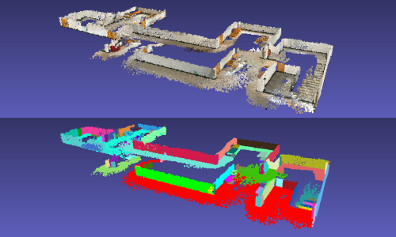
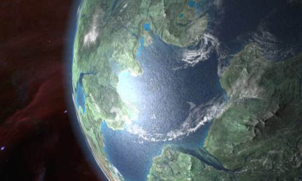
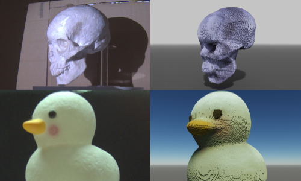
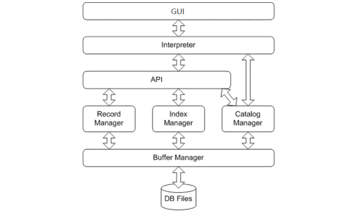








I am a senior student majoring in Computer Science and Technology at [Chu Kochen Honors College](http://ckc.zju.edu.cn/ckcen/main.htm), Zhejiang University, advised by Prof. [Hongzhi Wu](http://hongzhiwu.com/). I am also working as a research intern at [Microsoft Research Asia](https://www.microsoft.com/en-us/research/group/internet-graphics/), advised by Dr. [Yizhong Zhang](https://yizhongzhang1989.github.io/) and Dr. [Yang Liu](https://xueyuhanlang.github.io/).

My research interest includes computer graphics and 3D vision. 

# 🔥 News
- *2023.03*: I have been admitted to the [Master of Science in Computer Vision](https://www.ri.cmu.edu/education/academic-programs/master-of-science-computer-vision/) (MSCV) program at Carnegie Mellon University.

# 📖 Educations

	

        
	

	

        

            <b>Zhejiang University</b>, Hangzhou, China
  	        
                <i>2019.9 - 2023.6(expected)</i>
  	        
        

        

            <ul style="list-style-type:circle;">
                <li><b>Degree</b>: Bachelor of Engineering
                    <ul style="list-style-type:square;">
                		<li><b>Honors degree</b> from Chu Kochen Honors College</li>
                    </ul>
                </li>
                <li><b>Major</b>: Computer Science and Technology</li>
                <li><b>Overall GPA</b>: &nbsp;&nbsp;&nbsp;94.6/100&nbsp;&nbsp;&nbsp;3.98/4</li>
                <li><b>Ranking</b>: 1/125 in the first three years</li>
                <li><b>Thesis</b>: Real-Time SLAM System based on ARKit Framework <i>(Excellent Graduation Thesis)</i></li>
            </ul>
        

    

# 💻 Internships

	

        
	

	

        

            <b>Microsoft Research Asia</b>, Beijing, China
  	        
                <i>2022.3 - 2023.6(expected)</i>
  	        
        

        

            <ul style="list-style-type:circle;">
                <li><b>Position</b>: Research Intern in <a href="https://www.microsoft.com/en-us/research/group/internet-graphics/">Internet Graphics</a> group</li>
                <li><b>Advisor</b>: Dr. <a href="https://yizhongzhang1989.github.io/">Yizhong Zhang</a>, Dr. <a href="https://xueyuhanlang.github.io/">Yang Liu</a></li>
            </ul>
        

    

# 📝 Projects

	

        
	

	

        

            <b>Anti-aliasing Depth Fusion based on Vision Cone Model</b>
  	        
                <i>2022.11 - 2023.6</i>
  	        
        

        

            <i>Research Project at Microsoft Research Asia</i>
        

        

            Description.
        

    

	

        
	

	

        

            <b>Real-Time SLAM System based on ARKit Framework</b>
  	        
                <i>2022.3 - 2022.10</i>
  	        
        

        

            <i>Research Project at Microsoft Research Asia</i>
        

        

            We developed a SLAM system for accurate real-time tracking of camera trajectory when scanning indoor scenes with rich planar structures, using only an IOS device like iPhone or iPad. Our system gets the RGB-D data from the LiDAR camera, along with estimated camera poses computed by ARKit framework. It then searches for coplanar and parallel planes in the scene and uses them to optimize camera poses. Meanwhile, it uses a vocabulary tree and a two-dimensional confusion map to detect loops globally. Also, it exploits user's interaction to improve the precision of loop detection. Experiments show that our method improves the performance of camera localization and loop detection algorithms of ARKit. It allows users to scan large indoor scenes while still runs at real-time frame rate to give feedback to users.
        

    

	

        
	

	

        

            <b>C Compiler <a href="https://github.com/YJJfish/C-Compiler">[Project Page]</a></b>
  	        
                <i>2022.4 - 2022.6</i>
  	        
        

        

            <i>Course Project of Compiler Principle</i>
        

        

            We developed a compiler that can compile a C-like language into binary codes. The project is divided into three parts: Lexer and parser, code generation, and AST (Abstract Syntax Tree) visualization. The lexer and parser are based on lex and yacc. They receive the string and build an AST; The code generation module is based on LLVM. It receives the AST and generate binary codes; And we use HTML to visualize the AST.
        

    

	

        
	

	

        

            <b>3D Game: Interstellar <a href="https://github.com/YJJfish/Interstellar">[Project Page]</a></b>
  	        
                <i>2021.11 - 2021.12</i>
  	        
        

        

            <i>Course Project of Computer Graphics</i>
        

        

            We developed a 3D game based on OpenGL, where users can control a spaceship to travel in the universe, watch the view of space stations, planets and stars, and launch missiles to destory enemy spaceships. To make the visual effects more realistic, we applied several techniques, including specular mapping, normal mapping, light attenuation, and collision detection. We write our own programs for rendering and game logic, while the resource files (e.g. 3D models, textures) are from the game <a href="https://www.paradoxinteractive.com/games/stellaris/">Stellaris</a>.
        

    

	

        
	

	

        

            <b>Voxel Reconstruction of Opaque Objects <a href="https://github.com/YJJfish/Voxel-Reconstruction">[Project Page]</a></b>
  	        
                <i>2021.9 - 2021.10</i>
  	        
        

        

            <i>Course Project of Intelligent Acquisition of Visual Information</i>
        

        

            We proposed a system based on voxel carving and ray casting algorithm to reconstruct the 3D shapes of opaque objects. We use a projector to project structured light on the object and a camera to capture photos simultaneously. These photos are then used to extract silhouettes and estimate depth images of the object. We use silhouettes to carve the voxel model of the object, and use depth images to refine it. Finally, ray casting algorithm is used to color the reconstructed model.
        

    

	

        
	

	

        

            <b>MiniSQL <a href="https://github.com/YJJfish/MiniSQL">[Project Page]</a></b>
  	        
                <i>2021.5 - 2021.6</i>
  	        
        

        

            <i>Course Project of Database System</i>
        

        

            We developed a Database Management System called MiniSQL. It allows users to use SQL statements to 1. create and delete tables; 2. create and delete indices; 3. insert, delete, and select records in the database. The whole project is divided into 7 modules: GUI, interpreter, API, Record Manager, Index Manager, Catalog Manager, and Buffer Manager.
        

    

# 🎖 Honors and Awards

- 
