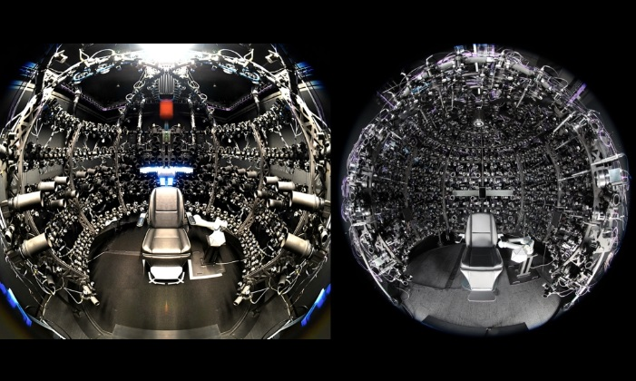








I am an incoming Research Engineer at [Meta Reality Labs](https://about.meta.com/realitylabs/). I earned my master's degree in [Computer Vision](https://www.ri.cmu.edu/education/academic-programs/master-of-science-computer-vision/) at [Carnegie Mellon University](https://www.cmu.edu/). Previously, I completed my bachelor's degree in [Computer Science and Technology](http://www.en.cs.zju.edu.cn/22145/list.htm) at [Zhejiang University](https://www.zju.edu.cn/english/), advised by Prof. [Hongzhi Wu](http://hongzhiwu.com/).

My interest includes Computer Graphics and 3D Vision.

# 📖 Education

	

        
	

	

        

            <b>Carnegie Mellon University</b>, Pittsburgh, U.S.
  	        
                <i>Sep 2023 - Dec 2024</i>
  	        
        

        

            <ul style="list-style-type:circle;">
                <li><b>Program</b>: Master of Science in Computer Vision</li>
                <li><b>Cumulative QPA</b>: 4.0/4.0</li>
            </ul>
        

    

	

        
	

	

        

            <b>Zhejiang University</b>, Hangzhou, China
  	        
                <i>Sep 2019 - Jun 2023</i>
  	        
        

        

            <ul style="list-style-type:circle;">
                <li><b>Degree</b>: Bachelor of Engineering
                    <ul style="list-style-type:square;">
                		<li><b>Honors degree</b> from Chu Kochen Honors College</li>
                    </ul>
                </li>
                <li><b>Major</b>: Computer Science and Technology</li>
                <li><b>Overall GPA</b>: &nbsp;&nbsp;&nbsp;94.6/100&nbsp;&nbsp;&nbsp;3.98/4</li>
                <li><b>Ranking</b>: &nbsp;&nbsp;&nbsp;1/125</li>
                <li><b>Thesis</b>: Real-Time SLAM System based on ARKit Framework <i>(Excellent Graduation Thesis)</i></li>
            </ul>
        

    

# 💻 Experience

	

        
	

	

        

            <b>Meta</b>, Pittsburgh, U.S.
  	        
                <i>Jan 2025 - Present</i>
  	        
        

        

            <ul style="list-style-type:circle;">
                <li><b>Position</b>: Research Engineer</li>
            </ul>
        

    

	

        
	

	

        

            <b>ByteDance</b>, San Jose, U.S.
  	        
                <i>May 2024 - Aug 2024</i>
  	        
        

        

            <ul style="list-style-type:circle;">
                <li><b>Position</b>: AR Effect Engineer Intern</li>
            </ul>
        

    

	

        
	

	

        

            <b>Meta</b>, Remote
  	        
                <i>Jan 2024 - May 2024 &amp; Sep 2024 - Dec 2024 </i>
  	        
        

        

            <ul style="list-style-type:circle;">
                <li><b>Position</b>: Student Researcher (School Project)</li>
                <li><b>Advisor</b>: Shubham Garg, Dr. Pei Wu</li>
            </ul>
        

    

	

        
	

	

        

            <b>Microsoft Research Asia</b>, Beijing, China
  	        
                <i>Mar 2022.3 - Jun 2023</i>
  	        
        

        

            <ul style="list-style-type:circle;">
                <li><b>Position</b>: Research Intern of <a href="https://www.microsoft.com/en-us/research/group/internet-graphics/">Internet Graphics</a> group</li>
                <li><b>Advisor</b>: Dr. <a href="https://yizhongzhang1989.github.io/">Yizhong Zhang</a>, Dr. <a href="https://xueyuhanlang.github.io/">Yang Liu</a></li>
            </ul>
        

    

# 📝 Projects

	

        
	

	

        

            <b>Optimizing and designing features for Effect House's Visual Effects system</b>
  	        
                <i>May 2024 - Aug 2024</i>
  	        
        

        

            <i>Internship Project at ByteDance</i>
        

        

            In this internship project, I optimized the particle attribute buffer in Effect House's Visual Effects (VFX) system, which saved more than 50% memory for most template VFX effects in Effect House. Besides, I implemented simulation node in VFX graph editor which allows users to use the VFX system as a general compute pipeline, apart from a GPU particle system. The users can use simulation node to achieve custom physics simulation effects. Finally, I implemented a 3D Gaussian Splatting output node to render 3D scenes using VFX particles.
        

    

	

        
	

	

        

            <b>Large Scale Camera Array Calibration via SfM <a href="https://mscvprojects.ri.cmu.edu/2024team4/">[Project Page]</a></b>
  	        
                <i>Jan 2024 - May 2024, Sep 2024 - Dec 2024</i>
  	        
        

        

            <i>Research Project at Meta</i>
        

        

            We developed an automated calibration system leveraging an efficient Structure-from-Motion (SfM) pipeline to calibrate hundreds of cameras in the dome. We improved accuracy by incorporating featuremetric refinement for detected keypoints and triangulated 3D points. Given the stability of extrinsic parameters in our setup, we introduced a novel intrinsics refinement stage following bundle adjustment. This stage refines intrinsic parameters using ground-truth extrinsics. Testing our method on <a href="https://github.com/facebookresearch/multiface">Multiface</a> demonstrated significant improvements, achieving approximately a 30% reduction in focal error and over a 90% reduction in principal point error.
        

    

	

        
	

	

        

            <b>KinectFusion - Vulkan <a href="https://github.com/YJJfish/KinectFusion-Vulkan">[Project Page]</a></b>
  	        
                <i>Mar 2024 - Apr 2024</i>
  	        
        

        

            <i>Course Project of Robot Localization and Mapping (16-833)</i>
        

        

            In this project, I implemented <a href="https://ieeexplore.ieee.org/document/6162880">KinectFusion</a> based on Vulkan. Different from CUDA, Vulkan is a cross-platform graphics API that supports both graphics rendering and parallel computing. Therefore, my implementation is cross-platform and supports real-time camera tracking, scene reconstruction, and graphics rendering at the same time. The estimated camera poses can also be used to render AR objects onto the input RGB images to achieve AR effects.
        

    

	

        
	

	

        

            <b>Render72: A real-time renderer based on Vulkan <a href="https://github.com/YJJfish/Renderer72">[Project Page]</a></b>
  	        
                <i>Jan 2024 - Apr 2024</i>
  	        
        

        

            <i>Course Project of Real-Time Graphics (15-472)</i>
        

        

            I developed a real-time renderer based on Vulkan. It supports multiple material types like mirror, lambertian, and pbr. The scene can have an environment map that can be used for image-based lighting by precomputing radiance/irradiance lookup tables.  The renderer also supports analytical lighting with shadow mapping (perspective / omnidirectional / cascade). It also supports deferred shading and screen space ambient occlusion (SSAO).
        

    

	

        
	

	

        

            <b>Anti-Blur Depth Fusion based on Vision Cone Model</b>
  	        
                <i>Nov 2022 - Jun 2023</i>
  	        
        

        

            <i>Research Project at Microsoft Research Asia</i>
        

        

            We proposed a depth fusion method to fuse low-resolution depth images while still maintaining high resolution information in the global model. Traditional methods like KinectFusion optimize the reconstruction by minimizing the difference between the reconstruction depths and captured depths. Therefore, they may produce blurred or aliased reconstructions when the image resolution is low. Our method is based on the assumption that the captured depth of a pixel equals to the average of actual depths within the pixel's vision cone. We designed loss functions to minimize difference between the average of reconstruction depths and captured depth. We have tested our method on both SDF voxel and mesh representations and got better reconstruction results than KinectFusion.
        

    

	

        
	

	

        

            <b>Real-Time SLAM System based on ARKit Framework</b>
  	        
                <i>Mar 2022 - Oct 2022</i>
  	        
        

        

            <i>Research Project at Microsoft Research Asia</i>
        

        

            We developed a SLAM system for real-time tracking of camera trajectory when scanning indoor scenes with rich planar structures, using only an IOS device like iPhone or iPad. Our system gets the RGB-D data from the LiDAR camera, along with estimated camera poses computed by ARKit framework. It then searches for coplanar and parallel planes in the scene and uses them to optimize camera poses. Meanwhile, it uses a vocabulary tree and a confusion map to detect loops globally. Additionally, it allows users to confirm detected loops via the UI to improve the precision. Also, to avoid memory overflow in long time scan, it uses an embedded database to store infrequently visited data. Experiments show that our method improves the performance of camera localization and loop detection algorithms of ARKit. It allows users to scan large indoor scenes while still runs at real-time frame rate to give feedback to users.
        

    

	

        
	

	

        

            <b>C Compiler <a href="https://github.com/YJJfish/C-Compiler">[Project Page]</a></b>
  	        
                <i>Apr 2022 - Jun 2022</i>
  	        
        

        

            <i>Course Project of Compiler Principle</i>
        

        

            We developed a compiler that can compile C language into binary codes. The project is divided into three parts: Lexer and parser, code generation, and AST (Abstract Syntax Tree) visualization. The lexer and parser are based on lex and yacc. They receive the source code string and build an AST; The code generation module is based on LLVM. It receives the AST and generate binary codes; And we use HTML to visualize the AST.
        

    

	

        
	

	

        

            <b>3D Game: Interstellar <a href="https://github.com/YJJfish/Interstellar">[Project Page]</a></b>
  	        
                <i>Nov 2021 - Dec 2021</i>
  	        
        

        

            <i>Course Project of Computer Graphics</i>
        

        

            We developed a 3D game based on OpenGL, where users can control a spaceship to travel in the universe, watch the view of space stations, planets and stars, and launch missiles to destory enemy spaceships. To make the visual effects more realistic, we applied several techniques, including specular mapping, normal mapping, light attenuation, and collision detection.
        

    

# 🔧 Skills

- **Programming Language**: C/C++, Python, JavaScript, Swift, Objective-C, Verilog
- **Tool&Framework**: Vulkan, OpenGL, Metal, OpenCV, CUDA, PyTorch, NumPy, MySQL, Doxygen, CMake
