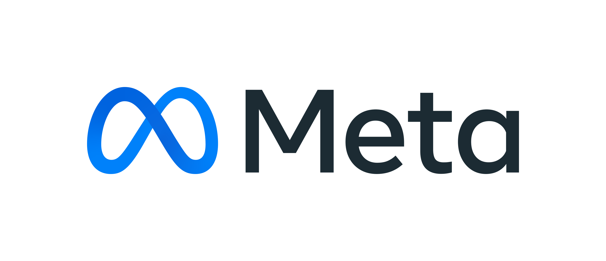
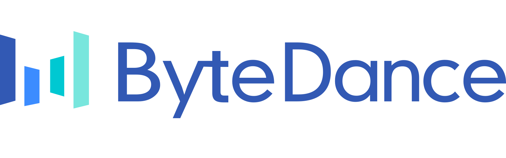
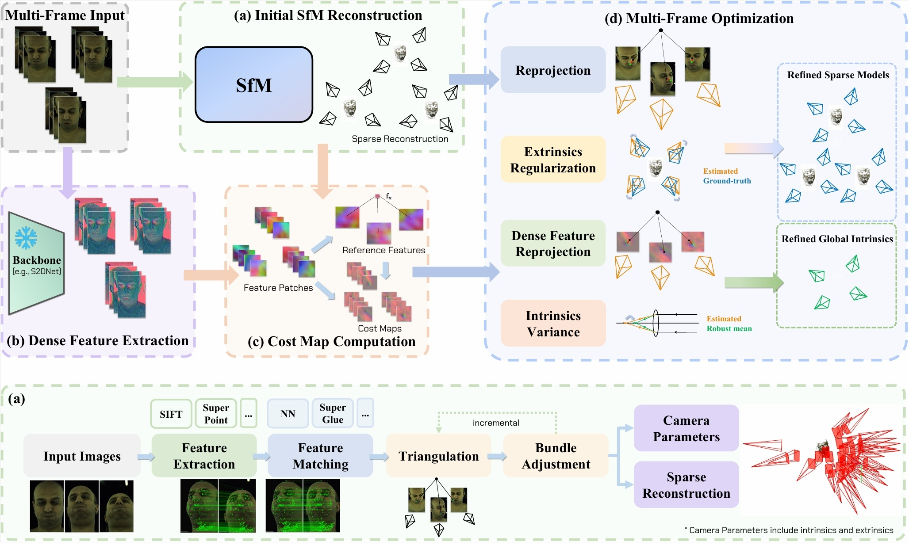
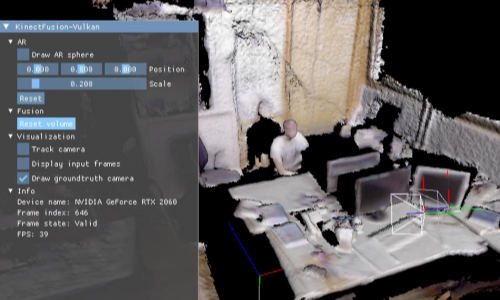
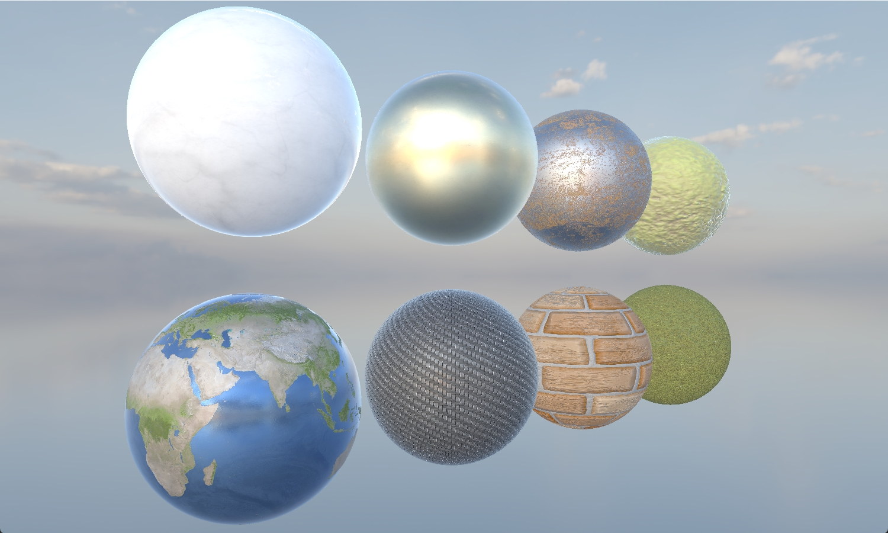
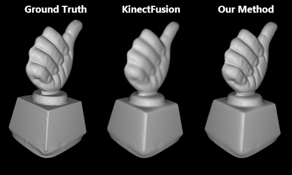
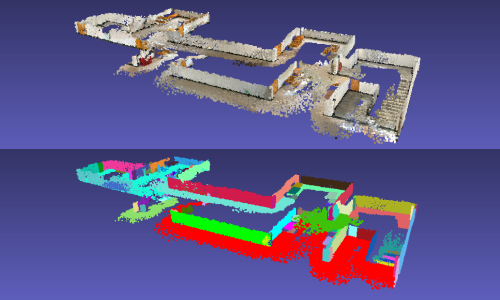








I am a Research Engineer at [Meta Reality Labs](https://about.meta.com/realitylabs/), working on GPU systems, real-time rendering, ML infrastructure, and performance optimization for photorealistic avatars in VR.

My work focuses on C++/Vulkan graphics rendering, GPU programming and profiling, shader/kernel optimization, developer tooling, and ML infrastructure.

I earned my master's degree in [Computer Vision](https://www.ri.cmu.edu/education/academic-programs/master-of-science-computer-vision/) from [Carnegie Mellon University](https://www.cmu.edu/). Previously, I completed my bachelor's degree in [Computer Science and Technology](http://www.en.cs.zju.edu.cn/22145/list.htm) at [Zhejiang University](https://www.zju.edu.cn/english/), where I was advised by Prof. [Hongzhi Wu](http://hongzhiwu.com/).

# 📖 Education

	

        
	

	

        

            <b>Carnegie Mellon University</b>, Pittsburgh, U.S.
  	        
                <i>Sep 2023 - Dec 2024</i>
  	        
        

        

            <ul style="list-style-type:circle;">
                <li><b>Program</b>: Master of Science in Computer Vision</li>
                <li><b>Cumulative QPA</b>: 4.0/4.0</li>
            </ul>
        

    

	

        
	

	

        

            <b>Zhejiang University</b>, Hangzhou, China
  	        
                <i>Sep 2019 - Jun 2023</i>
  	        
        

        

            <ul style="list-style-type:circle;">
                <li><b>Degree</b>: Bachelor of Engineering
                    <ul style="list-style-type:square;">
                		<li><b>Honors degree</b> from Chu Kochen Honors College</li>
                    </ul>
                </li>
                <li><b>Major</b>: Computer Science and Technology</li>
                <li><b>Overall GPA</b>: &nbsp;&nbsp;&nbsp;94.6/100&nbsp;&nbsp;&nbsp;3.98/4</li>
                <li><b>Ranking</b>: &nbsp;&nbsp;&nbsp;1/125</li>
            </ul>
        

    

# 💻 Experience

	

        
	

	

        

            <b>Meta Reality Labs</b>, Pittsburgh, U.S.
  	        
                <i>Jan 2025 - Present</i>
  	        
        

        <ul style="list-style-type:circle;">
            <li><b>Position</b>: Research Engineer</li>
            <li>Working on GPU systems, real-time rendering/inference infrastructure, and performance optimization for photorealistic avatars in VR.</li>
            <li>Optimized a Vulkan-based rendering backend with depth culling, tiled shading, render graph refactoring, async compute queues, and shader-level optimization.</li>
            <li>Built Python/C++ developer tooling for prototyping, profiling, benchmarking, and performance analysis of neural rendering workflows.</li>
            <li>Implemented CUDA-Vulkan interoperability for PyTorch CUDA tensors using external memory/semaphore mechanisms to reduce unnecessary CPU-GPU copies.</li>
            <li>Optimized a Wan video generation inference runtime using PyTorch AOTInductor-exported C++ graphs, improving execution efficiency through KV caching, CUDA Graph capture/replay, and quantization.</li>
        </ul>
    

	

        
	

	

        

            <b>ByteDance / TikTok</b>, San Jose, U.S.
  	        
                <i>May 2024 - Aug 2024</i>
  	        
        

        <ul style="list-style-type:circle;">
            <li><b>Position</b>: AR Effect Engineer Intern</li>
            <li>Worked on optimization and feature development for Effect House's Visual Effects system, focusing on GPU particle memory optimization, graph-based VFX authoring, and neural 3D scene rendering features.</li>
        </ul>
    

	

        
	

	

        

            <b>Microsoft Research Asia</b>, Beijing, China
  	        
                <i>Mar 2022 - Jun 2023</i>
  	        
        

        <ul style="list-style-type:circle;">
            <li><b>Position</b>: Research Intern of <a href="https://www.microsoft.com/en-us/research/group/internet-graphics/">Internet Graphics</a> group</li>
            <li><b>Advisor</b>: Dr. <a href="https://yizhongzhang1989.github.io/">Yizhong Zhang</a>, Dr. <a href="https://xueyuhanlang.github.io/">Yang Liu</a></li>
            <li>Worked on 3D reconstruction, depth fusion, and real-time AR/SLAM systems, combining computer vision algorithms, CUDA acceleration, C++ systems engineering, and iOS AR visualization.</li>
        </ul>
    

# 📝 Projects

	

        
	

	

        

            <b>Multi-Cali Anything <a href="https://wanghewei16.github.io/Multi-Cali-Anything">[Project Page]</a> <a href="https://arxiv.org/abs/2503.00737">[Paper]</a> <a href="https://github.com/YJJfish/Multi-Cali-Anything">[Code]</a></b>
  	        
                <i>Sep 2024 - Dec 2024</i>
  	        
        

        

            <i>Research Project at CMU; Accepted at IROS 2025</i>
        

        

            A dense-feature-driven camera calibration system for large-scale camera arrays that refines camera parameters directly from scene data, reducing the need for dedicated checkerboard captures.
        

        <ul style="list-style-type:circle;">
            <li>Developed a CUDA/C++ accelerated calibration system that integrates dense feature refinement into existing SfM pipelines.</li>
            <li>Implemented custom CUDA kernels for keypoint feature extraction, reference feature computation, and dense cost-map generation used in feature-metric optimization.</li>
            <li>Designed regularization terms for extrinsics alignment, dense feature reprojection loss, and multi-frame intrinsics consistency.</li>
            <li>Evaluated on the <a href="https://github.com/facebookresearch/multiface">Multiface</a> dataset, achieving calibration quality comparable to dedicated calibration while improving downstream reconstruction quality.</li>
        </ul>
    

	

        
	

	

        

            <b>Effect House Visual Effects System</b>
  	        
                <i>May 2024 - Aug 2024</i>
  	        
        

        

            <i>Internship Project at ByteDance</i>
        

        

            A ByteDance internship project focused on optimizing and extending the Effect House VFX system.
        

        <ul style="list-style-type:circle;">
            <li>Optimized GPU particle attribute buffer allocation and data layout, reducing memory usage by more than 50% for most VFX templates.</li>
            <li>Designed a simulation node in the VFX graph editor, allowing users to build customizable physics simulation workflows beyond standard particle effects.</li>
            <li>Implemented a 3D Gaussian Splatting output node to render neural 3D scenes through the VFX particle pipeline.</li>
        </ul>
    

	

        
	

	

        

            <b>KinectFusion-Vulkan <a href="https://github.com/YJJfish/KinectFusion-Vulkan">[Project Page]</a></b>
  	        
                <i>Mar 2024 - Apr 2024</i>
  	        
        

        

            <i>Course Project of Robot Localization and Mapping (16-833)</i>
        

        

            A Vulkan-based implementation of KinectFusion that integrates camera tracking, scene reconstruction, GPU-accelerated fusion, and real-time graphics rendering.
        

        <ul style="list-style-type:circle;">
            <li>Implemented a real-time 3D reconstruction system in C++/Vulkan, integrating GPU-accelerated fusion and visualization.</li>
            <li>Used Vulkan compute and graphics pipelines to support real-time reconstruction and AR rendering on RGB-D sequences.</li>
            <li>Rendered AR effects using estimated camera poses from the reconstruction pipeline.</li>
        </ul>
    

	

        
	

	

        

            <b>Render72: Real-Time Vulkan Renderer <a href="https://github.com/YJJfish/Renderer72">[Project Page]</a></b>
  	        
                <i>Jan 2024 - Apr 2024</i>
  	        
        

        

            <i>Course Project of Real-Time Graphics (15-472)</i>
        

        

            A real-time Vulkan renderer with a modular graphics backend for scene loading, animation, multi-pass rendering, and high-quality shading.
        

        <ul style="list-style-type:circle;">
            <li>Implemented deferred shading, shadow mapping, PBR/IBL, parallax mapping, SSAO, and multiple material types.</li>
            <li>Built rendering passes with attention to GPU memory usage, synchronization, and frame-time stability.</li>
            <li>Supported scene loading, animation playback, environment lighting, analytical lights, and screen-space effects.</li>
        </ul>
    

	

        
	

	

        

            <b>Anti-Blur Depth Fusion Based on Vision Cone Model</b>
  	        
                <i>Nov 2022 - Jun 2023</i>
  	        
        

        

            <i>Research Project at Microsoft Research Asia</i>
        

        

            A CUDA-accelerated depth fusion method designed to preserve high-frequency geometric details when fusing low-resolution depth images.
        

        <ul style="list-style-type:circle;">
            <li>Designed a vision-cone-based loss formulation that models each observed depth pixel as the average depth within its pixel cone.</li>
            <li>Implemented CUDA kernels to accelerate performance-critical loss computation and enable real-time reconstruction visualization.</li>
            <li>Evaluated the method on SDF voxel and mesh representations, improving reconstruction detail over baseline fusion methods.</li>
        </ul>
    

	

        
	

	

        

            <b>Real-Time SLAM System Based on ARKit Framework</b>
  	        
                <i>Mar 2022 - Oct 2022</i>
  	        
        

        

            <i>Research Project at Microsoft Research Asia</i>
        

        

            A real-time iOS AR scanning and reconstruction system using ARKit, a C++ SLAM/reconstruction backend, Objective-C bridging, SwiftUI UI, and Metal visualization.
        

        <ul style="list-style-type:circle;">
            <li>Integrated a C++ SLAM/reconstruction backend into an iOS ARKit app through an Objective-C bridge, SwiftUI interface, and Metal-based real-time visualization.</li>
            <li>Improved localization robustness using plane constraints from indoor scenes with rich planar structures.</li>
            <li>Implemented loop closure with vocabulary-tree retrieval and confusion-matrix filtering, with UI-based confirmation for detected loops.</li>
        </ul>
    

	

        
	

	

        

            <b>C Compiler <a href="https://github.com/YJJfish/C-Compiler">[Project Page]</a></b>
  	        
                <i>Apr 2022 - Jun 2022</i>
  	        
        

        

            <i>Course Project of Compiler Principle</i>
        

        

            An LLVM-based C-like language compiler built with C++, Flex/Bison, and LLVM.
        

        <ul style="list-style-type:circle;">
            <li>Implemented compiler components including grammar design, AST representation, code generation, test cases, and documentation.</li>
            <li>Used Flex/Bison for lexical analysis and parsing, and LLVM-14 C++ API for LLVM IR and object-code generation.</li>
            <li>Built an AST visualization tool to inspect parsed program structure.</li>
        </ul>
    

# 🔧 Skills

- **Programming**: C/C++, Python, GLSL, JavaScript, Swift, Objective-C
- **GPU, Graphics, and Systems**: Vulkan, CUDA, OpenGL, Metal, GPU profiling, shader/kernel optimization, RenderDoc, Nsight, CUDA-Vulkan interop
- **ML / CV / Runtime Infrastructure**: PyTorch, 3D Gaussian Splatting, TensorRT, neural rendering, OpenCV, model evaluation workflows
- **Tools**: CMake, Git, LLVM, Flex/Bison, Doxygen, Linux
